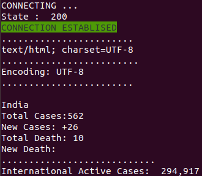

# Covid19_Case_Notification
This a Python script which gives live updates on New Covid19 patients in a Particular country(here India by default)


## Steps to Follow

### > Linux

```shell
$ sudo apt install python-gi gir1.2-notify-0.7

$ pip3 install beautifulsoup4

$ python3 main.py

```
### > Windows

```shell
$ pip install win10toast

$ pip install beautifulsoup4

$ python main.py

```

## Current State

### > Terminal


### > Notification


## Tree

```shell

.
├── images
│   ├── currentState.png
│   └── Notification.png
├── LICENSE
├── main.py
├── README.md
└── src
    ├── get_source.py
    └── notification
        ├── notify_linux.py
        ├── notify_windows.py
        └── __pycache__
            └── notify_linux.cpython-36.pyc

4 directories, 9 files
```
